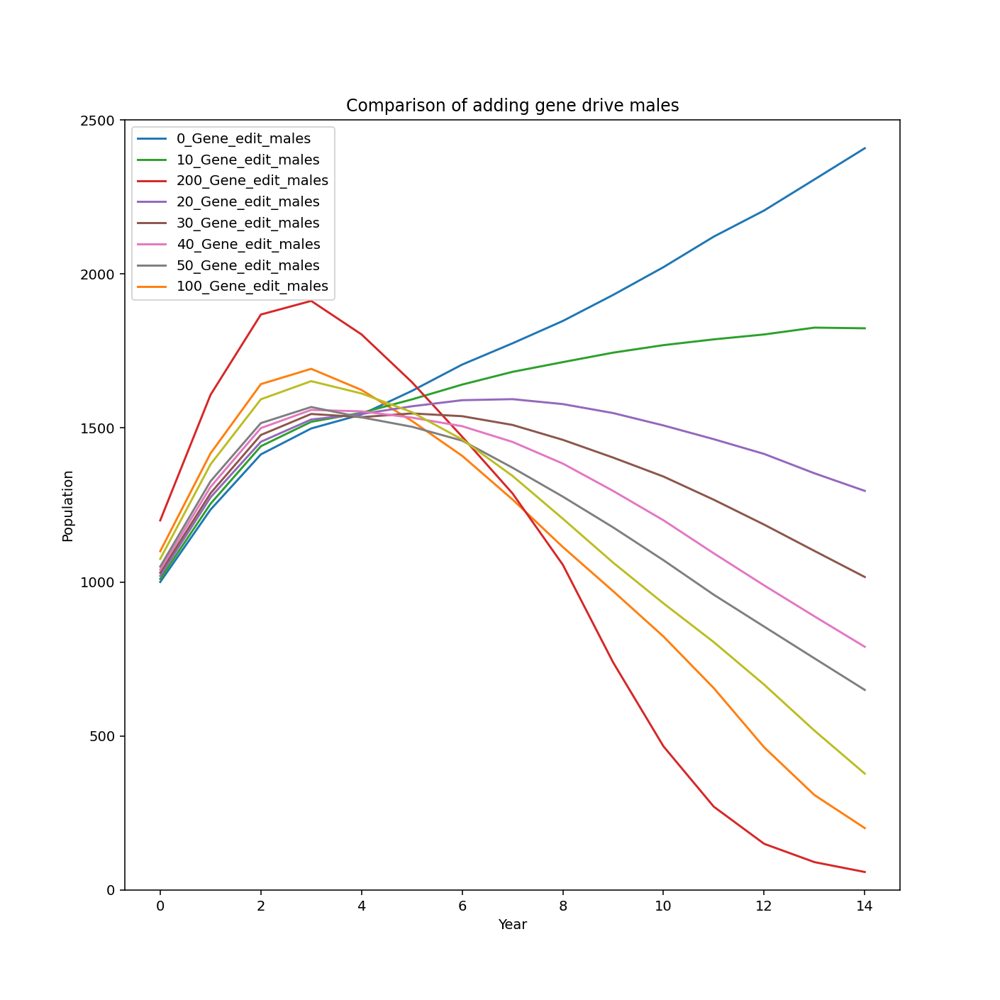
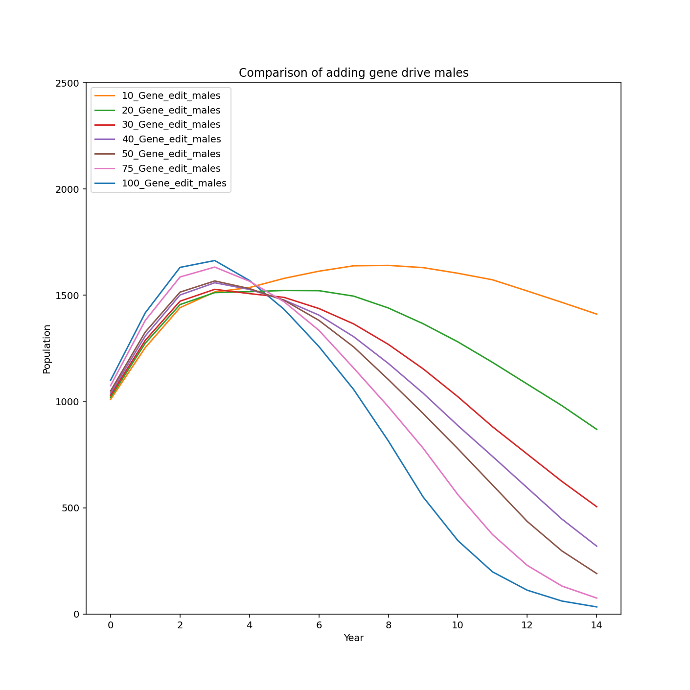

# Gene_Drive_Simulator_Public
Results and graphs from analysis of our proprietary simulator.

A genetic disease can cause males of a mammalian population to carry a mutated that gene that renders newborn females infertile.
This simulator checks to see how the spread of a genetic disease affects total population numbers for a period of time.

These are our results for version 0.1 of the simulator.

For 80% success rate:

For 100% success rate:

